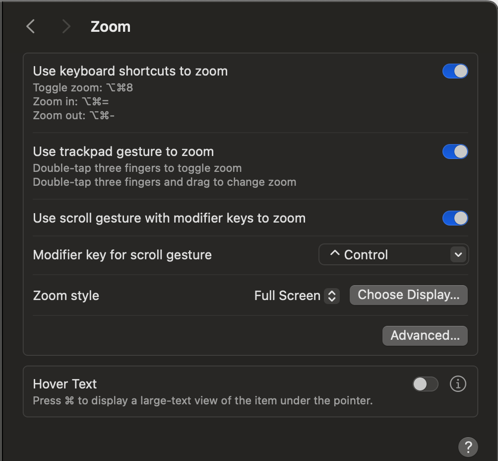
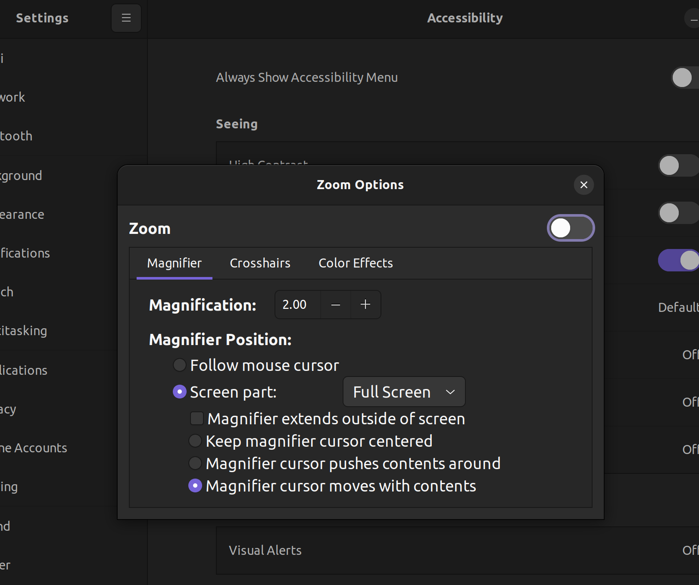
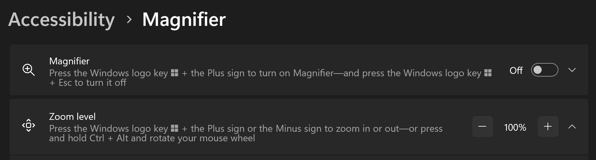

# Tips for Speakers

The page is created for speakers to help them prepare for the presentation.

## Improve presentation readability shortcuts

Quite often the presentation is not readable enough for the audience. Here are some shortcuts to improve readability.

### Increase font size Android Studio (IntelliJ)

- Mac
  - Increase font size: `Ctrl Shift .`
  - Decrease font size: `Ctrl Shift ,`
- Windows / Linux
  - Increase font size: `Alt Shift .`
  - Decrease font size: `Alt Shift ,`

### Increase font size Visual Studio Code

- Mac
  - Increase font size: `Cmd =`
  - Decrease font size: `Cmd -`
- Windows / Linux
  - Increase font size: `Ctrl =`
  - Decrease font size: `Ctrl -`

### Browser zoom

- Mac
  - Increase font size: `Cmd =`
  - Decrease font size: `Cmd -`
- Windows / Linux
  - Increase font size: `Ctrl =`
  - Decrease font size: `Ctrl -`

### Magnifier (OS level)

- Mac: `System settings` -> `Accessibility` -> `Zoom`  
  
  - Toggle zoom:  `Option Cmd 8`
  - Zoom in:      `Option Cmd =`
  - Zoom out:     `Option Cmd -`

- Linux(Ubuntu): `System settings` -> `Accessibility` -> `Zoom`  
  
  - Toggle zoom:  `Alt Super 8`
  - Zoom in:      `Alt Super =`
  - Zoom out:     `Alt Super -`
- Windows: `Windows settings` -> `Accessibility` -> `Magnifier`  
  
  - Zoom in:  `Super +`
  - Zoom out: `Super -`

### Mirror / Extended Mode Switching

- Mac: `Cmd F1` or `Cmd Fn F1`
- Windows / Linux: `Super p`

## Engaging Tips

- Ensure your voice is loud enough for everyone to hear before starting the presentation.
  - Wearing a microphone doesn't mean the room has a good sound system. It might be for recording purposes only.
- Face and speak to the audience instead of facing the laptop or presentation.
- Make it in time. Also, leave 5 ~ 10 min for questions.
  - You can tell people to come to you for more questions during break time.
- Clarify the question first before answering.
- Don't read the slides. The audience can read it themselves.
- Put only a little text on the slides. It's hard to read.
- Move around the stage, and don't only stay behind the laptop.
- Don't be afraid to ask the audience to clap their hands, raise their hands, or do something fun.
- Don't be afraid to ask Organizers for help before, after, or/and during the presentation.

## Credits

The tips are created with feedback from Flutter Montreal Community members. @bwnyasse suggested putting this page on GitHub to allow everyone to contribute.
